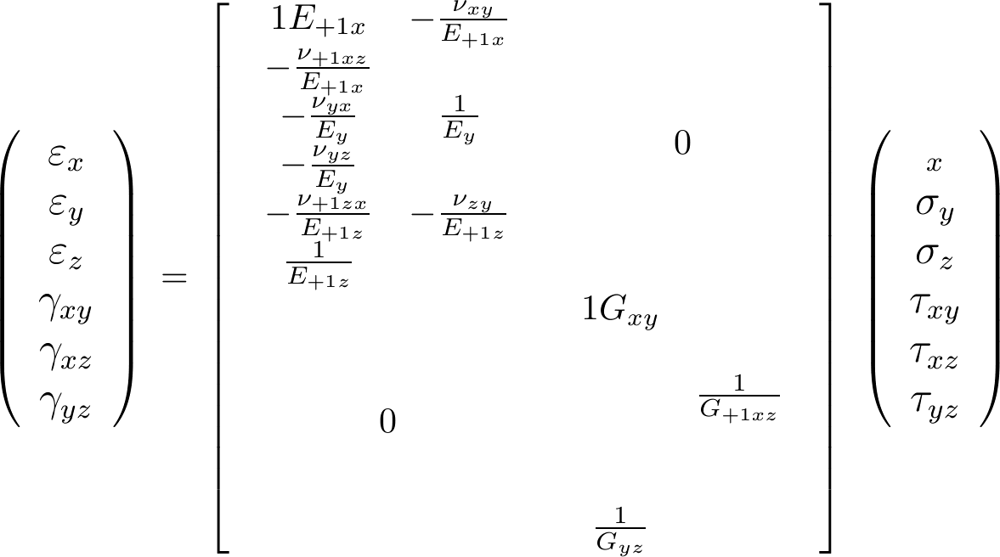
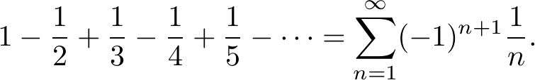
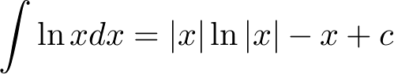
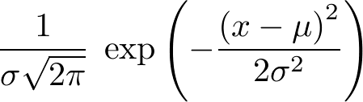

# latex2png

## About

The latex2png scripts are tools for parsing LaTeX snippets into png images. It comes in several flavors: a shell-script, a perl-script and an Octave/Matlab-script and a python script.

## Disclaimer

I built this in 2008 while playing with [mimetex](http://www.forkosh.com/mimetex.html).

## Prerequisites
All scripts require

* A LaTeX distribution e.g. LaTeX, MikTeX or TeTeX
* dvipng
* convert

## Installation

All three scripts require a LaTeX distribution and dvipng. The shell-script will only work in a Linux distribution, e.g. Ubuntu. I have only tested this script in Ubuntu 14.01 and [Travis CI](https://travis-ci.org/icaoberg/latex2png).

To install a `LaTeX` distribution in Ubuntu type in a terminal

```
sudo apt-get install texlive-full
```

To install `dvipng` in Ubuntu type in a terminal

```
sudo apt-get install dvipng
```

Comment: In most Linux distributions, you will find a `LaTeX` binary/link in `/usr/bin/latex` as well as another for `dvipng` in `/usr/bin/dvipng`. 

## latex2png.m

For `latex2png.m`, the Matlab-version of the script, you need Matlab. Matlab is a propietary scientific tool for Linux, Windows and MacOSX among others. I use Matlab a lot, and I thought about writing a function that would do the same job. I think that if you use Matlab Distributing Toolbox and/or run Matlab on a server you will find this script very useful.

The script has also been tested in Octave. To install Octave in Ubuntu type in a terminal

```
sudo apt-get install octave
```

## Examples

### array.tex
#### Image


#### LaTeX snippet

```
\begin{displaymath}
\normalsize         \left(\large\begin{array}{GC+23}         
\varepsilon_x\\\varepsilon_y\\\varepsilon_z\\\gamma_{xy}\\         
\gamma_{xz}\\\gamma_{yz}\end{array}\right)\ {\Large=}         
\ \left[\begin{array}{CC}         
\begin{array}\frac1{E_{\fs{+1}x}}         
&-\frac{\nu_{xy}}{E_{\fs{+1}x}}         
&-\frac{\nu_{\fs{+1}xz}}{E_{\fs{+1}x}}\\         
-\frac{\nu_{yx}}{E_y}&\frac1{E_{y}}&-\frac{\nu_{yz}}{E_y}\\         
-\frac{\nu_{\fs{+1}zx}}{E_{\fs{+1}z}}&         
-\frac{\nu_{zy}}{E_{\fs{+1}z}}         
&\frac1{E_{\fs{+1}z}}\end{array} & {\LARGE 0} \\         
{\LARGE 0} & \begin{array}\frac1{G_{xy}}&&\\         
&\frac1{G_{\fs{+1}xz}}&\\&&\frac1{G_{yz}}\end{array}         
\end{array}\right]         \ 
\left(\large\begin{array}         
\sigma_x\\\sigma_y\\\sigma_z\\\tau_{xy}\\\tau_{xz}\\\tau_{yz}         
\end{array}\right)
\end{displaymath}
```

### series.tex
#### Image


#### LaTeX snippet

```
\begin{displaymath}
1 - {1 \over 2} + {1 \over 3} - {1 \over 4} + {1 
\over 5} - \cdots =\sum_{n=1}^\infty (-1)^{n+1} {1 
\over n}.
\end{displaymath}
```

### integral.tex
#### Image


#### LaTeX snippet

```
\begin{displaymath}
\int \ln{x} dx = |x| \ln{|x|} - x +c
\end{displaymath}
```

### pdf.tex
#### Image


#### LaTeX snippet

```
\begin{displaymath}
\frac1{\sigma\sqrt{2\pi}}\; 
\exp\left(-\frac{\left(x-\mu\right)^2}{2\sigma^2} 
\right) \!
\end{displaymath}
```

## TODO
- [ ] latex2png.m
  - [x] Finish script
  - [x] Add demos/examples
  - [x] Test if script is compatible with Octave
  - [x] Test if script is compatible with Matlab
  - [x] Add tests to Travis CI config file
  - [ ] Merge dev branch into master
- [ ] latex2png.bash
  - [ ] Finish script
  - [ ] Add demos/examples
  - [ ] Add tests to Travis CI config file
  - [ ] Merge dev branch into master
- [ ] latex2png.pl
  - [ ] Finish script
  - [ ] Add demos/examples
  - [ ] Add tests to Travis CI config file
  - [ ] Merge dev branch into master
- [ ] latex2png.py
  - [ ] Finish script
  - [ ] Add demos/examples
  - [ ] Add tests to Travis CI config file
  - [ ] Merge dev branch into master
