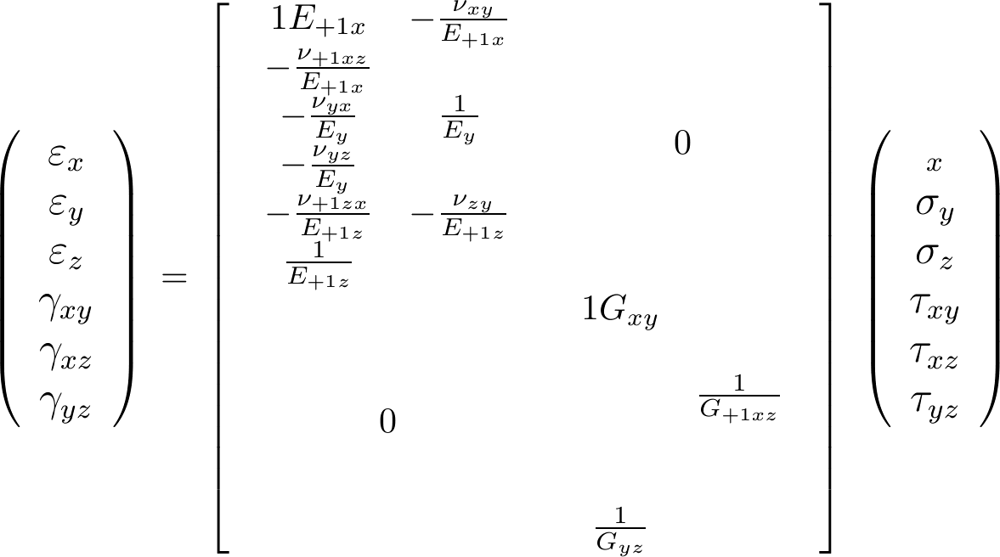
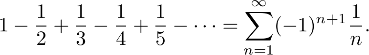
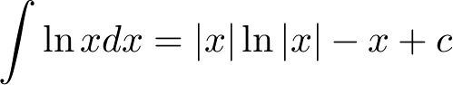
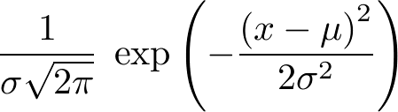

# latex2png

> **DEPRECATED**
> This project is no longer maintained. It was written in 2008 and has not been actively developed since. The bash, Perl, and Python variants were never completed. See [Alternatives](#alternatives) below for modern replacements.

---

## About

`latex2png` is a collection of scripts for converting LaTeX math snippets into PNG images. It was originally written in 2008 and includes a working Octave/Matlab script (`latex2png.m`). The shell, Perl, and Python variants were started but never finished.

## Alternatives

Several well-maintained tools now cover this use case more robustly:

- **[latex2image](https://github.com/lesteve/latex2image)** — Python-based CLI, actively maintained, supports multiple output formats (PNG, SVG, PDF).
- **[Matplotlib](https://matplotlib.org/)** — Set `usetex=True` to render LaTeX math directly in Python plots.
- **[SymPy](https://www.sympy.org/)** — `sympy.preview()` renders a LaTeX expression to a PNG without needing a separate script.
- **[KaTeX](https://katex.org/)** / **[MathJax](https://www.mathjax.org/)** — If your target is the web, these render LaTeX in the browser without any server-side image generation.
- **[Pandoc](https://pandoc.org/)** — Converts documents containing LaTeX math to many output formats including HTML and PDF.
- **[dvipng](https://savannah.nongnu.org/projects/dvipng/)** — The underlying tool used here; can be scripted directly for batch conversions.

## Disclaimer

Built in 2008 while experimenting with [mimetex](http://www.forkosh.com/mimetex.html). Kept here for historical reference.

## Prerequisites

- A LaTeX distribution (TeX Live, MiKTeX, or teTeX)
- `dvipng`

On Ubuntu/Debian:

```bash
sudo apt-get install texlive-full dvipng
```

## latex2png.m (Octave/Matlab)

This is the only variant that was completed and tested. It works in both Matlab and GNU Octave.

Install Octave on Ubuntu:

```bash
sudo apt-get install octave
```

## Examples

### array.tex


```latex
\begin{displaymath}
\normalsize         \left(\large\begin{array}{GC+23}         
\varepsilon_x\\\varepsilon_y\\\varepsilon_z\\\gamma_{xy}\\         
\gamma_{xz}\\\gamma_{yz}\end{array}\right)\ {\Large=}         
\ \left[\begin{array}{CC}         
\begin{array}\frac1{E_{\fs{+1}x}}         
&-\frac{\nu_{xy}}{E_{\fs{+1}x}}         
&-\frac{\nu_{\fs{+1}xz}}{E_{\fs{+1}x}}\\         
-\frac{\nu_{yx}}{E_y}&\frac1{E_{y}}&-\frac{\nu_{yz}}{E_y}\\         
-\frac{\nu_{\fs{+1}zx}}{E_{\fs{+1}z}}&         
-\frac{\nu_{zy}}{E_{\fs{+1}z}}         
&\frac1{E_{\fs{+1}z}}\end{array} & {\LARGE 0} \\         
{\LARGE 0} & \begin{array}\frac1{G_{xy}}&&\\         
&\frac1{G_{\fs{+1}xz}}&\\&&\frac1{G_{yz}}\end{array}         
\end{array}\right]         \ 
\left(\large\begin{array}         
\sigma_x\\\sigma_y\\\sigma_z\\\tau_{xy}\\\tau_{xz}\\\tau_{yz}         
\end{array}\right)
\end{displaymath}
```

### series.tex


```latex
\begin{displaymath}
1 - {1 \over 2} + {1 \over 3} - {1 \over 4} + {1 
\over 5} - \cdots =\sum_{n=1}^\infty (-1)^{n+1} {1 
\over n}.
\end{displaymath}
```

### integral.tex


```latex
\begin{displaymath}
\int \ln{x} dx = |x| \ln{|x|} - x +c
\end{displaymath}
```

### pdf.tex


```latex
\begin{displaymath}
\frac1{\sigma\sqrt{2\pi}}\; 
\exp\left(-\frac{\left(x-\mu\right)^2}{2\sigma^2} 
\right) \!
\end{displaymath}
```

## License

GNU General Public License v2 or later. See [LICENSE](LICENSE).
